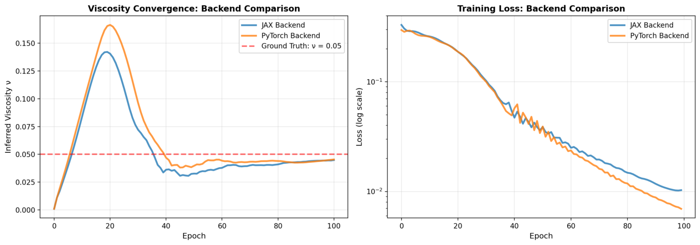

# Backend-Agnostic Inverse 1D Burgers Solver via Tesseract (Viscosity Estimation with JAX and PyTorch PINNs)

[](https://github.com/pasteurlabs/tesseract-core)
[](https://github.com/pasteurlabs/tesseract-jax)
[](https://github.com/google/jax)
[](https://pytorch.org/)
[](LICENSE)

**Overview**
This project demonstrates pipeline-level automatic differentiation across frameworks using Tesseract. An inverse 1D Burgers equation solver (Inferring viscosity parameter via physics-informed neural networks) runs with either JAX or PyTorch PINN backends while maintaining identical optimization code. When the PyTorch backend is selected, JAX gradients are computed through the Tesseract VJP interface, enabling cross-framework automatic differentiation.

**Key implementations:**
- Implementation of `apply`, `vector_jacobian_product`, and `jacobian_vector_product` endpoints for both JAX and PyTorch PINNs
- Demonstration of JAX optimizer computing gradients through PyTorch models via Tesseract's VJP endpoint
- Backend-agnostic inverse problem pipeline with swappable implementations (Pytorch/Jax) 

---

## Contents

- [Problem Statement](#problem-statement)
- [Implementation](#implementation)
- [Installation](#installation)
- [Usage](#usage)
- [References](#references)

---

## Problem Statement

Given noisy observations of the 1D Burgers equation solution, infer the unknown viscosity parameter $\nu$:

$$
\frac{\partial u}{\partial t} + u \frac{\partial u}{\partial x} = \nu \frac{\partial^2 u}{\partial x^2}
$$

where:
- $u(x, t)$ is the velocity field on $[0, 1] \times [0, T]$
- $\nu$ is the kinematic viscosity (inferred parameter)
- Initial condition: $u(x, 0) = \sin(2\pi x)$
- Boundary conditions: periodic on $[0, 1]$

Synthetic observations are generated using a heat equation approximation $u(x,t) \approx \sin(2\pi x) \cdot \exp(-\nu(2\pi)^2 t)$, valid for small viscosity, with additive Gaussian noise ($\sigma = 0.02$). This provides ground truth data with known $\nu$ for validating the inverse solver.

A physics-informed neural network (PINN) minimizes a combined loss function:

$$\mathcal{L} = \mathcal{L}_{\text{data}} + \lambda_{\text{physics}} \cdot \mathcal{L}_{\text{physics}} + \lambda_{\text{IC}} \cdot \mathcal{L}_{\text{IC}} + \lambda_{\text{BC}} \cdot \mathcal{L}_{\text{BC}}$$

where:
- $\mathcal{L}_{\text{data}}$: mean squared error between predictions and observations
- $\mathcal{L}_{\text{physics}}$: PDE residual at collocation points
- $\mathcal{L}_{\text{IC}}$: initial condition violation
- $\mathcal{L}_{\text{BC}}$: boundary condition violation

> **Note:** <small> In this demo, synthetic data are generated from a heat‑equation approximation of Burgers for small viscosity, which remains smooth and does not exhibit shock formation. The focus is on inverse viscosity estimation and pipeline‑level autodiff, not on resolving nonlinear shock dynamics.
---

## Implementation

### Architecture

The PINN uses Fourier feature encoding to mitigate spectral bias:

```
Input (x, t) ∈ ℝ²
    ↓
Fourier encoding: [x, t, sin(x·B_x), cos(x·B_x), sin(t·B_t), cos(t·B_t)]
    ↓
MLP: 130 → 64 → 64 → 64 → 1 (tanh activations)
    ↓
Output: u(x, t)
```

Derivatives ($\partial u/\partial x$, $\partial u/\partial t$, $\partial^2 u/\partial x^2$) are computed via automatic differentiation within each Tesseract using the native framework's autograd: `jax.grad` for the JAX backend and `torch.autograd.grad` for the PyTorch backend.

### Tesseract Endpoints

Both `pinn_jax` and `pinn_pytorch` implement:

1. **apply(inputs)**: Forward pass returning u_pred, u_x, u_t, u_xx
2. **vector_jacobian_product(...)**: Reverse-mode AD for gradient computation
3. **jacobian_vector_product(...)**: Forward-mode AD for sensitivity analysis etc (not used in this project)

Input/output schemas use Tesseract's `Differentiable[Array[...]]` annotations to declare which fields participate in autodiff.

### Cross-Framework Gradient Flow

The optimization loop in `inverse_problem.py` demonstrates Tesseract-mediated gradient computation:

```python
# Load backend (JAX or PyTorch)
pinn = Tesseract.from_image("pinn_jax")  # or "pinn_pytorch"

# Define loss using Tesseract apply
def compute_loss(viscosity, params, ...):
    result = apply_tesseract(pinn, {"x": x, "t": t, "params_flat": params})
    # ... compute data + physics + IC + BC losses
    return total_loss

# System-level gradients computed via Tesseract VJP (regardless of backend)
grad_visc = jax.grad(compute_loss, argnums=0)    # ∂L/∂ν
grad_params = jax.grad(compute_loss, argnums=1)  # ∂L/∂params

# When jax.grad is called, it triggers Tesseract's VJP endpoint
# For PyTorch backend: Tesseract VJP internally uses torch.autograd.grad
# For JAX backend: Tesseract VJP internally uses jax.grad
v_grad = grad_visc(viscosity, params, ...)
p_grad = grad_params(viscosity, params, ...)
```

> **Key point:** The system-level gradients ($\partial \mathcal{L}/\partial \nu$ and $\partial \mathcal{L}/\partial \text{params}$) are computed through Tesseract's `vector_jacobian_product` endpoint for both backends. The backend selection only determines which autograd implementation Tesseract uses internally for its VJP computation.

### Project Structure

```
tesseract-pinn-inverse-burgers/
├── inverse_problem.py         # CLI demo comparing JAX/PyTorch backends
├── app.py                     # Streamlit interactive interface
├── buildall.sh                # Builds Docker containers for both backends
├── pyproject.toml
└── tesseracts/
    ├── pinn_jax/
    │   ├── tesseract_api.py        # JAX/Equinox PINN with Tesseract endpoints
    │   ├── tesseract_config.yaml
    │   └── tesseract_requirements.txt
    └── pinn_pytorch/
        ├── tesseract_api.py        # PyTorch PINN with Tesseract endpoints
        ├── tesseract_config.yaml
        └── tesseract_requirements.txt
```

---

## Installation

**Requirements:** Python ≥3.10, Docker

```bash
# Clone repository
git clone https://github.com/julian-8897/tesseract-pinn-inverse-burgers.git
cd tesseract-pinn-inverse-burgers

# Create virtual environment using uv and activate
uv venv
source .venv/bin/activate

# Install dependencies via uv's pip shim
uv pip install -e .

# Build Tesseract containers (requires Docker running)
./buildall.sh

# Verify built images
docker images | grep pinn
```

---

## Usage

### via CLI

```bash
# Compare both backends
python inverse_problem.py --backend both --epochs 100

# Single backend
python inverse_problem.py --backend jax --epochs 50
python inverse_problem.py --backend pytorch --epochs 50
```

### via Streamlit

```bash
streamlit run app.py
```

The Streamlit app provides:
- Adjustable hyperparameters (viscosity, noise, learning rate)
- Real-time training visualization
- Gradient flow inspector (Tesseract API call statistics)
- Solution comparison (PINN vs analytical)

---

## Results
PINN inferred viscosity converges close to ground truth \((\nu = 0.05)\) for both backends after 100 epochs:
<table align="center" cellpadding="12">
  <tr>
    <td align="center">
      
      <div><em>PINN solution comparison (JAX vs PyTorch)</em></div>
    </td>
  </tr>
</table>


## References

**Tesseract Documentation:**
- [Tesseract Core](https://github.com/pasteurlabs/tesseract-core) — Main repository and CLI
- [Tesseract-JAX](https://github.com/pasteurlabs/tesseract-jax) — JAX integration layer
- [Creating Tesseracts](https://docs.pasteurlabs.ai/projects/tesseract-core/latest/content/creating-tesseracts/create.html) — Implementation guide
- [Differentiable Programming](https://docs.pasteurlabs.ai/projects/tesseract-core/latest/content/introduction/differentiable-programming.html) — VJP/JVP concepts

**Related Publications to PINNs:**
- Raissi, M., Perdikaris, P., & Karniadakis, G. E., ["Physics-informed neural networks: A deep learning framework for solving forward and inverse problems involving nonlinear partial differential equations"](https://www.sciencedirect.com/science/article/pii/S0021999118307125), *Journal of Computational Physics* 378 (2019): 686-707
- Tancik, M., Srinivasan, P. P., Mildenhall, B., Fridovich-Keil, S., Raghavan, N., Singhal, U., Ramamoorthi, R., & Ng, R., ["Fourier Features Let Networks Learn High Frequency Functions in Low Dimensional Domains"](https://arxiv.org/abs/2006.10739), *NeurIPS* 2020

---

## Compatibility

| Component | Version | Notes |
|-----------|---------|-------|
| tesseract-core | 1.2.0 | Runtime and CLI |
| tesseract-jax | 0.2.3 | JAX integration |
| Python | ≥3.10 | Type hints required |
| Docker | latest | Container execution |
| JAX | 0.8.2 | CPU backend |
| PyTorch | 2.9.1 | PyTorch backend |
| Equinox | 0.13.2 | JAX PINN modules |
| Optax | 0.2.6 | JAX optimizer |

**Tested platforms:** macOS (Apple Silicon)

---

## License

Licensed under [Apache License 2.0](LICENSE).
